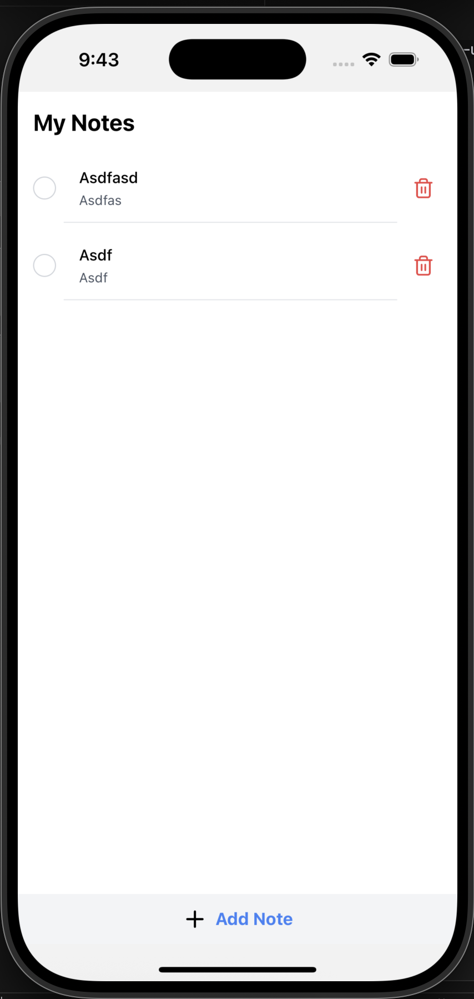

# 📝 React Native Task Manager App

A lightweight, mobile-friendly task/note manager built with React Native and Expo. This app keeps things simple — add, complete, and delete notes with clean visuals and smooth feedback.

---

## 🚀 Getting Started

To run the app locally:

1. **Clone the repository**
   ```bash
   git clone git@github.com:Theskrtnerd/expo-todo-app.git
   cd expo-todo-app
   ```

2. **Install dependencies**

   ```bash
   pnpm install
   ```

3. **Start the development server**

   ```bash
   pnpm start
   ```

You’ll be prompted to open the app in:

* [Expo Go](https://expo.dev/go) on your mobile device
* An Android emulator
* An iOS simulator
* A development build (for full native support)

> 💡 You can start editing inside the `app/` directory. This project uses [file-based routing](https://docs.expo.dev/router/introduction/).

---

## 📱 App Overview

This app offers a focused note/task-taking experience with a clean UI and intuitive interactions.

### 🗂 Main Features

* **View Notes**
  All your notes are listed in a scrollable list under **"My Notes"**. Each item shows:

  * A **title** in bold
  * A **subtitle** in lighter text

* **Mark as Complete**
  Tap the **circle icon** on the left of any note to toggle its completion state. Completed items can appear visually distinct (e.g., faded or checked).

* **Delete Notes**
  Tap the **trash icon** on the right to remove a note instantly.

* **Add Notes**
  Use the **“+ Add Note”** bar at the bottom of the screen to add new entries. A modal or inline form allows you to type the title and subtitle. The new note is then added to the list.

---

## ✅ Features Summary

* Add new notes with a title and subtitle
* Toggle task completion with one tap
* Delete tasks with a trash icon
* View all tasks in a clean, scrollable list
* Responsive UI with clear visual feedback

---

## 🧩 Tech Stack

* **[Expo](https://expo.dev/)** – for rapid mobile development
* **[React Native](https://reactnative.dev/)** – the foundation of the app
* **[NativeWind](https://www.nativewind.dev/)** – Tailwind-style utility classes for consistent styling
* **[React Native Reanimated](https://docs.swmansion.com/react-native-reanimated/)** – performant animations and transitions
* **[Lucide React Native](https://github.com/lucide-icons/lucide)** – elegant, customizable icons

---

## 📁 Project Structure

* `app/`: Contains screens and components
* `components/`: Reusable UI elements
* Local state only — no Redux or external state management
* Uses `useState`, `useEffect`, and props for logic

---

## 📝 Notes

This app was created as part of a front-end tech screen to demonstrate:

* Component-driven development
* Local state and prop usage
* Clean UI/UX design
* Mobile-first interaction design with Expo

---

## 📸 Screenshot

> Main UI – with completed and incomplete notes, plus the Add Note CTA at the bottom



---

## 📄 License

This project is for technical review and not intended for production use.
